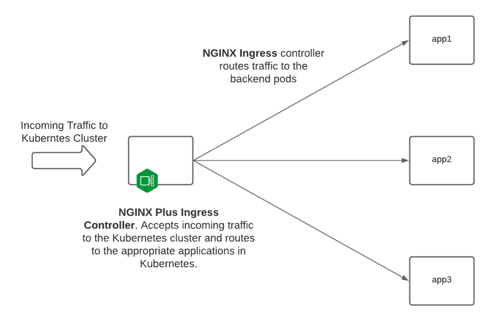

NGINX Ingress Controller can now be used as the ingress controller for applications that are running inside an Istio service mesh. This allows to continue using the advanced capabilities that NGINX IC provides on Istio-based environments without resorting to any workarounds. 


Prior to 1.11 release, a configuration below would send two host headers to the backend; 

```
apiVersion: k8s.nginx.org/v1
kind: VirtualServer
metadata:
  name: foo 
spec:
  host: foo.example.com
  upstreams:
  - name: foo
    port: 8080
    service: backend-svc
  routes:
  - path: "/"
    action:
      proxy:
        upstream: foo
        requestHeaders:
          set:
          - name: Host
            value: bar.example.com
```

In 1.11 release, NGINX Ingress controller will only send one host header, depending on how you configure Ingress. By default NGINX Ingress Controller will send `proxy_set_header $host`. If Ingress has been configured with `requestHeaders` per the above example, this ensures that only one set of headers will be sent to the upstream server. In short, by setting `action-proxy-requestHeaders` in the `VirtualServer` CRD, NGINX Ingress will only send the specified hears that have been defined.

Here is a standard deployment of NGINX Ingress controller without any service mesh deployed:    







When deploying NGINX Ingress controller with Istio, you must deploy the envoy sidecar proxy into the NGINX Ingress controller pod.   
The image below is what NGINX Ingress and Istio deployment looks like:


By default for NGINX Ingress Controller, we populate the upstream server addresses with the endpoint IPs of the pods. NGINX Ingress Controller 1.11 release now supports the ability to configure NGINX Ingress CRDs (virtualServer/virtualServerRoute)to use the `service/cluster IP`. Using this flag,  NGINX Ingress will generate the .conf with the `service/cluster IP` of the service in the `upstreams/servers` section, instead of pod endpoint IPs. To enable NGINX Ingress to route to the `Service IP`, we are going to use a new feature released in 1.11; [use-cluster-ip](https://docs.nginx.com/nginx-ingress-controller/configuration/virtualserver-and-virtualserverroute-resources/#upstream).   
 Here is a simple example of what your `upstream` section will look like now in `virtualServer/virtualServerRoute`:

```
upstreams:
  - name: tea
    service: tea-svc
    port: 80
    use-cluster-ip: true
  - name: coffee
    service: coffee-svc
    port: 80
    use-cluster-ip: true
```

Now NGINX Ingress `upstreams` will be populated with the `Service/cluster IP`. In the example above, the service/cluster IPs for `tea-svc` and `coffee-svc` will be added to the `upstream` configuration as the `server` addresses.

## Setting up NGINX Plus Ingress controller for Istio.

When deploying NGINX Plus KIC with Istio, you will need to modify your Depoloyment file to include the specific items needed to work with Istio. Those four specific lines are:

```
traffic.sidecar.istio.io/includeInboundPorts: ""
traffic.sidecar.istio.io/excludeInboundPorts: "80,443" 
traffic.sidecar.istio.io/excludeOutboundIPRanges: "substitute_for_correct_subnet_range"
sidecar.istio.io/inject: 'true'
```
Additional information on the above annotations can be found on Istios website.

Your updated nginx-plus-ingress.yaml file will look something like this with the added annotations:
```
apiVersion: apps/v1    
kind: Deployment    
metadata:    
  name: nginx-ingress    
  namespace: nginx-ingress    
spec:    
  replicas: 1    
  selector:    
    matchLabels:    
      app: nginx-ingress    
  template:    
    metadata:    
      labels:    
        app: nginx-ingress    
      annotations:    
       #prometheus.io/scrape: "true"
        traffic.sidecar.istio.io/includeInboundPorts: ""    
        traffic.sidecar.istio.io/excludeInboundPorts: "80,443"    
        traffic.sidecar.istio.io/excludeOutboundIPRanges: "10.90.0.0/16,10.45.0.0/16" 
        sidecar.istio.io/inject: 'true'
```

## Install Istio
 

You can then install Istio by your preferred method (helm, operator etc.). Deploy Istio into your cluster. In this case, I ran the following command to install Istio into my cluster:

```
istioctl install --set profile=minimal
```

We need to make sure that Istio injects sidecar proxies into our namespace for our testing. To do so, we need to tell Istio what namespaces to inject sidecars into. We can do that with the following command:
```
kubectl label ns <namespace_specified> istio-injection=enabled
```
Since I installed NGINX ingress and my application into the same namespace, I specified nginx-ingress with the istio-injection=enabled label on that namespace.

```
kubectl label namespace nginx-ingress istio-injection=enabled
```
 

Using kubectl we can see that the namespace for our demo (nginx-ingress) now has istio-injection=enabled specified:

```
kubectl get namespacess -A --show-labels


default                Active   28h   <none>
istio-system           Active   24h   istio-injection=disabled
kube-node-lease        Active   28h   <none>
kube-public            Active   28h   <none>
kube-system            Active   28h   <none>
kubernetes-dashboard   Active   16h   <none>
local-path-storage     Active   28h   <none>
nginx-ingress          Active   27h   istio-injection=enabled
```

After we have setup and configured Istio, we can then deploy NGINX Plus Ingress as well as our applications that will be part of the service mesh. Istio will now inject sidecar proxies based upon how we have configured Istio (namespace configuration).     
Now, our deployment will look like the following (with Envoy sidecar proxies).


We can now see that after configuring Istio with the necessary pieces needed to install a sidecar proxy into the same pod as NGINX ingress, after we deploy NGINX ingress, there are two containers in the same pod for Nginx Ingress:  one is NGINX-ingress, the other is the istio sidecar proxy.

```
kubectl get pods -A

NAMESPACE       NAME                                      READY   STATUS    RESTARTS   AGE
kube-system     coredns-854c77959c-h2vrq                  1/1     Running   0          60m
kube-system     metrics-server-86cbb8457f-fct86           1/1     Running   0          60m
kube-system     local-path-provisioner-5ff76fc89d-5hjbl   1/1     Running   0          60m
istio-system    istiod-7c9c9d46d4-qpgff                   1/1     Running   0          60m
nginx-ingress   nginx-ingress-5898f94c49-v4jrf            2/2     Running   1          41s
```
 

For our application, we are using two new features released in v1.11. These are avaiable in `VirtualServer/VirtualServeroute`.

Here is our VirtualServer configuration to use with Istio: (note `use-cluster-ip` and `requestHeaders`)

```
apiVersion: k8s.nginx.org/v1    
kind: VirtualServer    
metadata:    
  name: cafe    
  namespace: nginx-ingress
spec:    
  host: cafe.example.com    
  tls:    
    secret: cafe-secret    
  upstreams:    
  - name: tea    
    service: tea-svc    
    port: 80    
    use-cluster-ip: true
  - name: coffee    
    service: coffee-svc    
    port: 80    
    use-cluster-ip: true
  routes:    
  - path: /tea    
    action:
      proxy:
        upstream: tea
        requestHeaders:
          set:
          - name: Host
            value: tea-svc.nginx-ingress.svc.cluster.local
  - path: /coffee
    action:
      proxy:
        upstream: coffee
        requestHeaders:
          set:
          - name: Host
            value: coffee-svc.nginx-ingress.svc.cluster.local
```

With our new Host header control in v1.11, when VirtualServer is configured with `requestHeaders`, the value specified will be used and `proxy_set_header $host` will NOT be used. By enabling `use-cluster-ip` to **true**, NGINX will forward requests to the service IP. In our above example, that would be `tea-svc` and `coffee-svc`.

Here is the output of `nginx -T` to show our upstreams and proxy_set_header values 
The server in the upstream is the IP address of the service for that given application)

```
upstream vs_nginx-ingress_cafe_tea {
    zone vs_nginx-ingress_cafe_tea 256k;
    random two least_conn;
    server 10.96.222.104:80 max_fails=1 fail_timeout=10s max_conns=0;
}

upstream vs_nginx-ingress_cafe_coffee {
    zone vs_nginx-ingress_cafe_coffee 256k;
    random two least_conn;
    server 10.96.252.249:80 max_fails=1 fail_timeout=10s max_conns=0;
}

server {
    listen 80;
        
    location /tea {

        proxy_set_header Upgrade $http_upgrade;
        proxy_set_header Connection $vs_connection_header;
        proxy_set_header X-Real-IP $remote_addr;
        proxy_set_header X-Forwarded-For $proxy_add_x_forwarded_for;
        proxy_set_header X-Forwarded-Host $host;
        proxy_set_header X-Forwarded-Port $server_port;
        proxy_set_header X-Forwarded-Proto $scheme;
            
        proxy_set_header Host "tea-svc.nginx-ingress.svc.cluster.local";
    }
    
    location /coffee {
 
        proxy_set_header Upgrade $http_upgrade;
        proxy_set_header Connection $vs_connection_header;
        proxy_set_header X-Real-IP $remote_addr;
        proxy_set_header X-Forwarded-For $proxy_add_x_forwarded_for;
        proxy_set_header X-Forwarded-Host $host;
        proxy_set_header X-Forwarded-Port $server_port;
        proxy_set_header X-Forwarded-Proto $scheme;
            
        proxy_set_header Host "coffee-svc.nginx-ingress.svc.cluster.local";
    }   
}
```
Notice the abscence of `proxy_set_header $host`. This is because we are using `action-proxy-requestHeaders` option to specify what headers we want to pass to Istio sidecar. This is required by Istio.

Now we can test our NGINX Ingress with Istio setup with a simple curl request to our application.


curl -kI https://cafe.example.com/coffee
```
HTTP/1.1 200 OK
Server: nginx/1.19.5
Date: Thu, 25 Mar 2021 18:47:21 GMT
Content-Type: text/plain
Content-Length: 159
Connection: keep-alive
expires: Thu, 25 Mar 2021 18:47:20 GMT
cache-control: no-cache
x-envoy-upstream-service-time: 0
x-envoy-decorator-operation: coffee-svc.nginx-ingress.svc.cluster.local:80/*
```

We can see in the above output, our curl request is sent and received by NGINX Ingress. We can see that the envoy sidecar proxy then sends the request to the service IP to the application (coffee), with the full request being complete and correct. Now we have a full working NGINX+ Ingress with Istio as the sidecar proxies are deployed.

 

For disabling/removing sidecar proxies and autoinjection:
 

To remove label from the namespace:
```
kubectl lable ns default istio-injection-
```